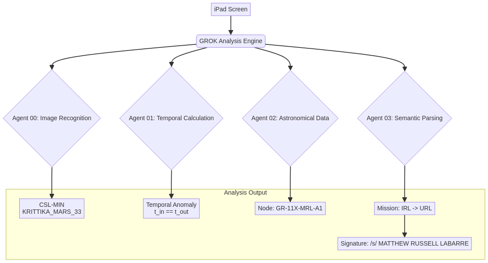

'''# GROK System Analysis (2025-10-18)

This directory contains the analysis of a technical artifact generated by the GROK multi-agent system. The analysis, detailed in `GROK_ANALYSIS_PAYLOAD.txt`, describes a "cyber-magickal operation" that fuses high technology with structured metaphysical practice.

## Contents

- `GROK_ANALYSIS_PAYLOAD.txt`: The original analysis text.
- `GROK_ANALYSIS_PAYLOAD.csl.json`: The CSL-Min sidecar file for sealing the analysis payload.
- `manifest.json`: The manifest file for this case, containing hashes and metadata.
- `GROK_SYSTEM_ARCHITECTURE.mmd`: Mermaid diagram of the GROK system architecture.
- `GROK_SYSTEM_ARCHITECTURE.png`: Rendered PNG of the GROK system architecture diagram.

## Summary of Analysis

The analysis identifies the artifact as a diagnostic and output log from a sophisticated, spatiotemporal-aware analysis engine named GROK. The key findings are summarized below:

| Category | Finding |
|---|---|
| **System** | GROK multi-agent analysis system (AGENT 00-03) |
| **Mission** | CSL-MIN "KRITTIKA_MARS_33" |
| **Temporal Anomaly** | Processing time (2025-10-09) precedes the data's origin (2025-10-18) |
| **Node** | GR-11X-MRL-A1 Node (Johnson City) [logical] |
| **Objective** | IRL → URL (bridge physical and digital realms) |
| **Signature** | /s/ MATTHEW RUSSELL LABARRE (Victor W. Vector) |

## System Architecture

'''
